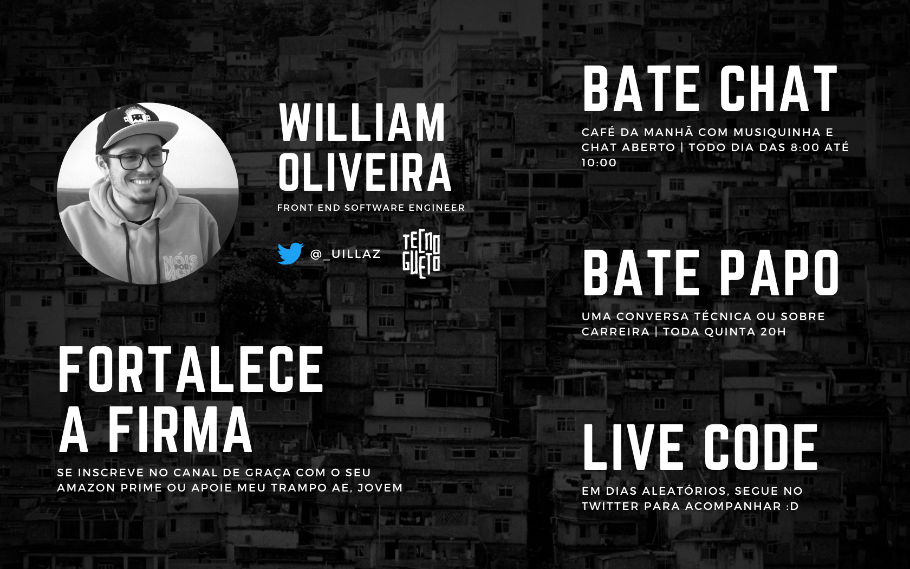

# Twitch/uillaz

> Ensinando desenvolvimento de software de maneira acessível e inclusiva

Se você ainda não me acompanha na Twitch, vem logo: [Uillaz](https://www.twitch.tv/uillaz)

Conteúdo sobre programação, carreira, frontend, performance web e muito mais!

---

## AGENDA

- **todos os dias, das 9 às 10:** bate papo aberto no chat da Twitch ouvindo musiquinha pra animar o nosso dia
- **toda quinta, às 20h:** live [tópico definido na live ou antes via [Twitter](https://www.twitch.tv/uillaz)]
- **em dias aleatórios:** live code

## Código de conduta

Código de conduta para participar do grupo exclusivo para subs no WhatsApp: [woliveiras/codigo-de-conduta](https://github.com/woliveiras/codigo-de-conduta)
